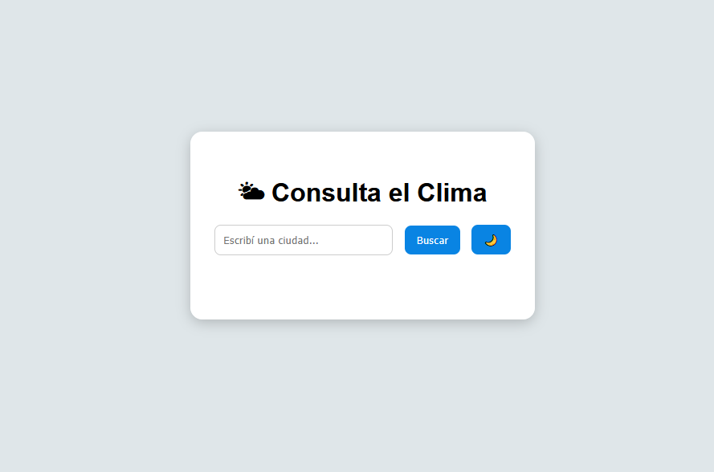
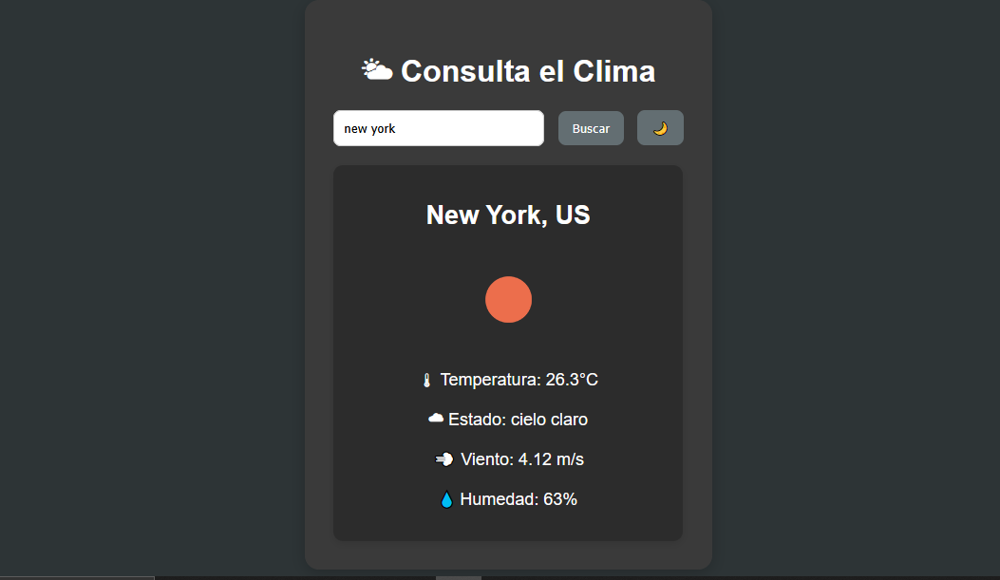
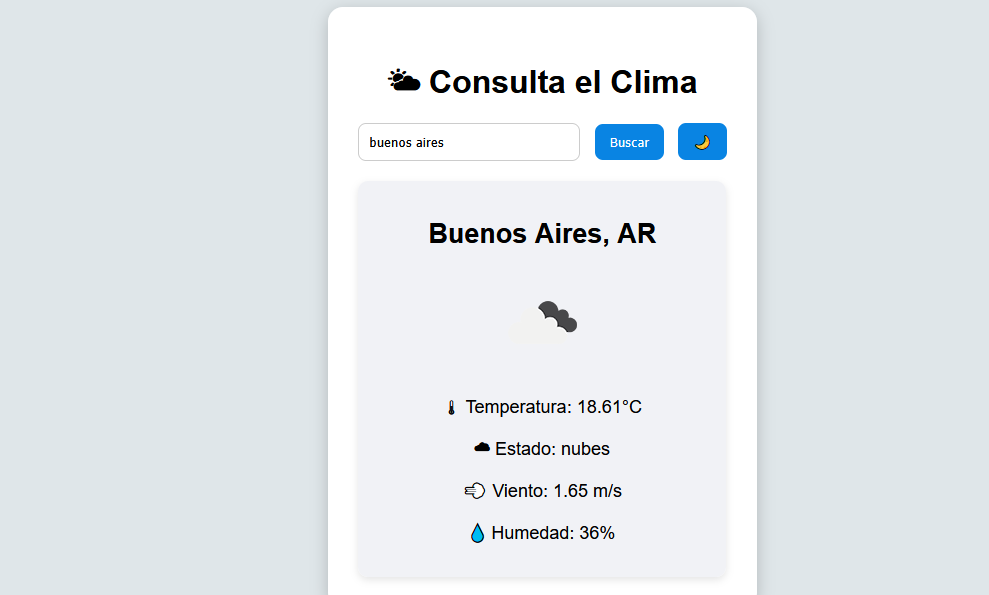

# 🌦️ App del Clima

Una **aplicación web simple y atractiva** desarrollada con **HTML, CSS y JavaScript**, que permite consultar el clima actual de cualquier ciudad en tiempo real usando la API de **OpenWeatherMap**.  
Incluye **íconos dinámicos**, validación de errores, **modo claro/oscuro** y animaciones suaves.

---

## 🚀 Funcionalidades

- 🔍 Buscar el clima de cualquier ciudad en el mundo.  
- 🌡 Mostrar **temperatura, estado del clima, viento y humedad**.  
- 🖼 Visualización con **íconos dinámicos** según el clima.  
- ⚠️ Manejo de errores (ciudad vacía o no encontrada).  
- 🌗 **Modo claro/oscuro** con un botón de cambio.  
- ✨ Animaciones suaves para mostrar resultados.  
- 📱 Diseño responsive (PC y móviles).  

---

## 📂 Estructura del proyecto

app-clima/  
│── index.html   # Estructura principal  
│── style.css    # Estilos (claro/oscuro + responsive)  
│── script.js    # Lógica en JavaScript (reemplazar API key)  
│── README.md    # Documentación (este archivo)  
│── assets/      # Capturas de pantalla (screenshot.png, screenshot1.png, ...)  

---

## 📸 Capturas de pantalla

  
  
 


---

## 🛠️ Cómo ejecutar el proyecto

1. Cloná el repositorio (si aún no lo tenés local):
   ```bash
   git clone https://github.com/TU-USUARIO/app-clima.git


📄 Licencia

Proyecto con licencia MIT — libre para usar y modificar.


👨‍💻 Autor

Desarrollado por Ponce Ricardo Andrés 🚀
Proyecto creado con fines de práctica y aprendizaje.